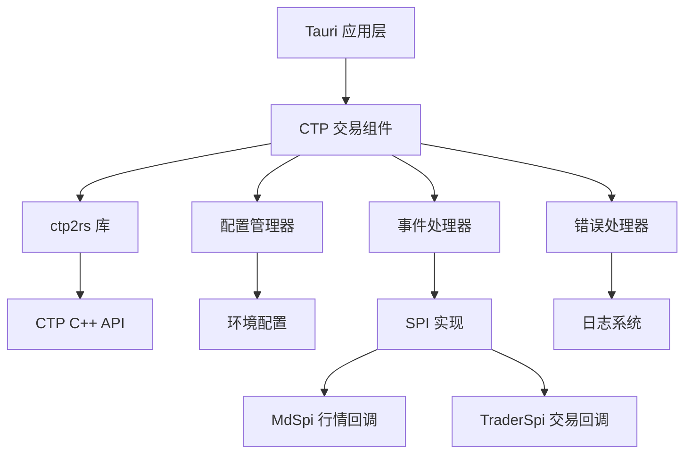

# CTP 交易组件设计文档

## 概述

CTP 交易组件是一个基于 Rust 的高性能期货交易接口封装，直接使用 `ctp2rs` 库与 CTP 的 C++ API 进行集成。该组件提供了类型安全、内存安全的 Rust 接口，同时保持了 CTP API 的高性能特性。

设计目标：
- 基于成熟的 ctp2rs 库，避免重复造轮子
- 提供简洁易用的高级 API 封装
- 确保内存安全和线程安全
- 支持异步操作和事件驱动架构
- 提供完善的错误处理机制
- 支持多环境配置（SimNow、TTS、生产环境）

## 架构

### 整体架构图



### 分层架构

1. **Tauri 应用层**
   - 前端界面交互
   - 业务逻辑协调
   - 用户操作处理

2. **CTP 交易组件层**
   - 高级 API 封装
   - 配置管理
   - 事件处理和分发
   - 错误处理和重连

3. **ctp2rs 库层**
   - CTP API 的 Rust 绑定
   - 内存安全保证
   - 类型转换处理

4. **CTP C++ API 层**
   - 原生 CTP 接口
   - 网络通信
   - 协议处理

## 组件和接口

### 核心组件

#### 1. CTP 客户端 (CtpClient)

```rust
use ctp2rs::v1alpha1::{MdApi, TraderApi, MdSpi, TraderSpi};
use std::sync::Arc;

pub struct CtpClient {
    config: CtpConfig,
    md_api: Option<Arc<MdApi>>,
    trader_api: Option<Arc<TraderApi>>,
    md_spi: Option<Box<dyn MdSpi>>,
    trader_spi: Option<Box<dyn TraderSpi>>,
    state: Arc<Mutex<ClientState>>,
}

impl CtpClient {
    pub fn new(config: CtpConfig) -> Result<Self, CtpError>;
    pub fn connect_md(&mut self) -> Result<(), CtpError>;
    pub fn connect_trader(&mut self) -> Result<(), CtpError>;
    pub fn login(&mut self) -> Result<(), CtpError>;
    pub fn subscribe_market_data(&self, instruments: &[String]) -> Result<(), CtpError>;
    pub fn submit_order(&self, order: &OrderRequest) -> Result<(), CtpError>;
    pub fn cancel_order(&self, order_ref: &str) -> Result<(), CtpError>;
    pub fn query_account(&self) -> Result<(), CtpError>;
    pub fn query_positions(&self) -> Result<(), CtpError>;
    pub fn disconnect(&mut self);
}
```

#### 2. SPI 实现 (MdSpiImpl & TraderSpiImpl)

```rust
use ctp2rs::v1alpha1::*;

pub struct MdSpiImpl {
    client_state: Arc<Mutex<ClientState>>,
    event_sender: tokio::sync::mpsc::UnboundedSender<CtpEvent>,
    config: CtpConfig,
}

impl MdSpi for MdSpiImpl {
    fn on_front_connected(&mut self);
    fn on_front_disconnected(&mut self, reason: i32);
    fn on_rsp_user_login(&mut self, rsp: Option<&CThostFtdcRspUserLoginField>, 
                         rsp_info: Option<&CThostFtdcRspInfoField>, 
                         request_id: i32, is_last: bool);
    fn on_rsp_sub_market_data(&mut self, instrument: Option<&CThostFtdcSpecificInstrumentField>,
                              rsp_info: Option<&CThostFtdcRspInfoField>,
                              request_id: i32, is_last: bool);
    fn on_rtn_depth_market_data(&mut self, data: Option<&CThostFtdcDepthMarketDataField>);
    fn on_rsp_error(&mut self, rsp_info: Option<&CThostFtdcRspInfoField>, 
                    request_id: i32, is_last: bool);
}

pub struct TraderSpiImpl {
    client_state: Arc<Mutex<ClientState>>,
    event_sender: tokio::sync::mpsc::UnboundedSender<CtpEvent>,
    config: CtpConfig,
}

impl TraderSpi for TraderSpiImpl {
    fn on_front_connected(&mut self);
    fn on_front_disconnected(&mut self, reason: i32);
    fn on_rsp_authenticate(&mut self, rsp: Option<&CThostFtdcRspAuthenticateField>,
                           rsp_info: Option<&CThostFtdcRspInfoField>,
                           request_id: i32, is_last: bool);
    fn on_rsp_user_login(&mut self, rsp: Option<&CThostFtdcRspUserLoginField>,
                         rsp_info: Option<&CThostFtdcRspInfoField>,
                         request_id: i32, is_last: bool);
    fn on_rsp_order_insert(&mut self, order: Option<&CThostFtdcInputOrderField>,
                           rsp_info: Option<&CThostFtdcRspInfoField>,
                           request_id: i32, is_last: bool);
    fn on_rtn_order(&mut self, order: Option<&CThostFtdcOrderField>);
    fn on_rtn_trade(&mut self, trade: Option<&CThostFtdcTradeField>);
    // ... 其他交易相关回调
}
```

#### 3. 事件处理系统 (EventSystem)

```rust
#[derive(Debug, Clone)]
pub enum CtpEvent {
    Connected,
    Disconnected,
    LoginSuccess(LoginResponse),
    LoginFailed(CtpError),
    MarketData(MarketDataTick),
    OrderUpdate(OrderStatus),
    TradeUpdate(TradeRecord),
    AccountUpdate(AccountInfo),
    PositionUpdate(Vec<Position>),
    Error(CtpError),
}

pub struct EventHandler {
    sender: tokio::sync::mpsc::UnboundedSender<CtpEvent>,
    receiver: tokio::sync::mpsc::UnboundedReceiver<CtpEvent>,
}

impl EventHandler {
    pub fn new() -> Self;
    pub async fn next_event(&mut self) -> Option<CtpEvent>;
    pub fn send_event(&self, event: CtpEvent) -> Result<(), CtpError>;
}
```

#### 4. 数据模型 (Data Models)

```rust
#[derive(Debug, Clone, Serialize, Deserialize)]
pub struct MarketDataTick {
    pub instrument_id: String,
    pub last_price: f64,
    pub volume: i64,
    pub turnover: f64,
    pub open_interest: i64,
    pub bid_price1: f64,
    pub bid_volume1: i32,
    pub ask_price1: f64,
    pub ask_volume1: i32,
    pub update_time: String,
    pub update_millisec: i32,
}

#[derive(Debug, Clone, Serialize, Deserialize)]
pub struct OrderRequest {
    pub instrument_id: String,
    pub direction: OrderDirection,
    pub offset_flag: OffsetFlag,
    pub price: f64,
    pub volume: i32,
    pub order_type: OrderType,
    pub time_condition: TimeCondition,
}

#[derive(Debug, Clone, Serialize, Deserialize)]
pub struct Position {
    pub instrument_id: String,
    pub direction: PositionDirection,
    pub total_position: i32,
    pub yesterday_position: i32,
    pub today_position: i32,
    pub open_cost: f64,
    pub position_cost: f64,
    pub margin: f64,
    pub unrealized_pnl: f64,
}
```

### 接口设计

#### 1. 异步接口

所有网络操作和可能阻塞的操作都提供异步接口：

```rust
pub trait AsyncCtpApi {
    async fn connect(&mut self) -> Result<(), CtpError>;
    async fn login(&mut self, credentials: LoginCredentials) -> Result<LoginResponse, CtpError>;
    async fn subscribe_market_data(&mut self, instruments: &[String]) -> Result<(), CtpError>;
    async fn submit_order(&mut self, order: OrderRequest) -> Result<OrderResponse, CtpError>;
    async fn query_account(&mut self) -> Result<AccountInfo, CtpError>;
}
```

#### 2. 事件监听接口

```rust
pub trait EventListener {
    fn on_market_data(&self, tick: MarketDataTick);
    fn on_order_update(&self, order: OrderStatus);
    fn on_trade_update(&self, trade: TradeRecord);
    fn on_account_update(&self, account: AccountInfo);
    fn on_error(&self, error: CtpError);
}
```

## 数据模型

### 核心数据结构

#### 1. 配置模型

```rust
use std::path::PathBuf;

#[derive(Debug, Clone, Serialize, Deserialize)]
pub struct CtpConfig {
    // 连接配置
    pub broker_id: String,          // 经纪商代码
    pub user_id: String,            // 用户代码
    pub password: String,           // 密码
    pub app_id: String,             // 应用标识
    pub auth_code: String,          // 授权编码
    
    // 服务器地址
    pub md_front_address: String,   // 行情前置地址
    pub td_front_address: String,   // 交易前置地址
    
    // 动态库路径
    pub md_dynlib_path: PathBuf,    // 行情动态库路径
    pub td_dynlib_path: PathBuf,    // 交易动态库路径
    
    // 流文件路径
    pub flow_path: String,          // 流文件目录
    
    // 超时和重连配置
    pub timeout_secs: u64,          // 超时时间（秒）
    pub reconnect_interval_secs: u64, // 重连间隔（秒）
    pub max_reconnect_attempts: u32,  // 最大重连次数
}

#[derive(Debug, Clone, ValueEnum)]
pub enum Environment {
    /// SimNow 模拟环境
    Sim,
    /// TTS 7x24 测试环境
    Tts,
    /// 生产环境
    Prod,
}

impl CtpConfig {
    pub fn for_environment(env: Environment, user_id: String, password: String) -> Self {
        match env {
            Environment::Sim => Self::simnow_config(user_id, password),
            Environment::Tts => Self::tts_config(user_id, password),
            Environment::Prod => Self::production_config(user_id, password),
        }
    }
    
    fn simnow_config(user_id: String, password: String) -> Self {
        Self {
            broker_id: "5071".to_string(),
            user_id,
            password,
            app_id: "inspirai_strategy_1.0.0".to_string(),
            auth_code: "0000000000000000".to_string(),
            md_front_address: "tcp://58.62.16.148:41214".to_string(),
            td_front_address: "tcp://58.62.16.148:41206".to_string(),
            md_dynlib_path: Self::get_md_dynlib_path(),
            td_dynlib_path: Self::get_td_dynlib_path(),
            flow_path: "./ctp_flow".to_string(),
            timeout_secs: 30,
            reconnect_interval_secs: 5,
            max_reconnect_attempts: 3,
        }
    }
    
    fn tts_config(user_id: String, password: String) -> Self {
        Self {
            broker_id: "9999".to_string(),
            user_id,
            password,
            app_id: "simnow_client_test".to_string(),
            auth_code: "0000000000000000".to_string(),
            md_front_address: "tcp://121.37.80.177:20004".to_string(),
            td_front_address: "tcp://121.37.80.177:20002".to_string(),
            md_dynlib_path: Self::get_md_dynlib_path(),
            td_dynlib_path: Self::get_td_dynlib_path(),
            flow_path: "./ctp_flow".to_string(),
            timeout_secs: 30,
            reconnect_interval_secs: 5,
            max_reconnect_attempts: 3,
        }
    }
    
    #[cfg(target_os = "macos")]
    fn get_md_dynlib_path() -> PathBuf {
        PathBuf::from("./lib/macos/TraderapiMduserapi_6.7.7_CP_MacOS/thostmduserapi_se.framework/thostmduserapi_se")
    }
    
    #[cfg(target_os = "macos")]
    fn get_td_dynlib_path() -> PathBuf {
        PathBuf::from("./lib/macos/TraderapiMduserapi_6.7.7_CP_MacOS/thosttraderapi_se.framework/thosttraderapi_se")
    }
}
```

#### 2. 错误模型

```rust
#[derive(Debug, thiserror::Error)]
pub enum CtpError {
    #[error("连接错误: {0}")]
    ConnectionError(String),
    
    #[error("认证失败: {0}")]
    AuthenticationError(String),
    
    #[error("网络错误: {0}")]
    NetworkError(String),
    
    #[error("CTP API 错误: {code} - {message}")]
    CtpApiError { code: i32, message: String },
    
    #[error("数据转换错误: {0}")]
    ConversionError(String),
    
    #[error("配置错误: {0}")]
    ConfigError(String),
    
    #[error("动态库加载错误: {0}")]
    LibraryLoadError(String),
    
    #[error("超时错误")]
    TimeoutError,
    
    #[error("状态错误: {0}")]
    StateError(String),
    
    #[error("IO 错误: {0}")]
    IoError(#[from] std::io::Error),
    
    #[error("序列化错误: {0}")]
    SerializationError(#[from] serde_json::Error),
    
    #[error("未知错误: {0}")]
    Unknown(String),
}

impl CtpError {
    /// 从 CTP 响应信息创建错误
    pub fn from_rsp_info(rsp_info: &CThostFtdcRspInfoField) -> Self {
        let error_msg = gb18030_cstr_i8_to_str(&rsp_info.ErrorMsg)
            .unwrap_or("未知错误".to_string());
        
        Self::CtpApiError {
            code: rsp_info.ErrorID,
            message: error_msg,
        }
    }
    
    /// 检查是否为致命错误（需要重连）
    pub fn is_fatal(&self) -> bool {
        matches!(self, 
            CtpError::ConnectionError(_) | 
            CtpError::NetworkError(_) |
            CtpError::LibraryLoadError(_)
        )
    }
}
```

### 数据转换

#### 使用 ctp2rs 提供的转换工具

```rust
use ctp2rs::ffi::{gb18030_cstr_i8_to_str, AssignFromString, WrapToString};
use ctp2rs::v1alpha1::*;

pub struct DataConverter;

impl DataConverter {
    /// 将 CTP 行情数据转换为业务模型
    pub fn convert_market_data(ctp_data: &CThostFtdcDepthMarketDataField) -> MarketDataTick {
        MarketDataTick {
            instrument_id: ctp_data.InstrumentID.to_string(),
            trading_day: ctp_data.TradingDay.to_string(),
            update_time: ctp_data.UpdateTime.to_string(),
            update_millisec: ctp_data.UpdateMillisec,
            last_price: ctp_data.LastPrice,
            volume: ctp_data.Volume as i64,
            turnover: ctp_data.Turnover,
            open_interest: ctp_data.OpenInterest as i64,
            bid_price1: ctp_data.BidPrice1,
            bid_volume1: ctp_data.BidVolume1,
            ask_price1: ctp_data.AskPrice1,
            ask_volume1: ctp_data.AskVolume1,
            open_price: ctp_data.OpenPrice,
            high_price: ctp_data.HighestPrice,
            low_price: ctp_data.LowestPrice,
            pre_close_price: ctp_data.PreClosePrice,
            upper_limit_price: ctp_data.UpperLimitPrice,
            lower_limit_price: ctp_data.LowerLimitPrice,
        }
    }
    
    /// 将业务订单请求转换为 CTP 结构体
    pub fn convert_order_request(order: &OrderRequest, config: &CtpConfig) -> CThostFtdcInputOrderField {
        let mut ctp_order = CThostFtdcInputOrderField::default();
        
        // 基本信息
        ctp_order.BrokerID.assign_from_str(&config.broker_id);
        ctp_order.InvestorID.assign_from_str(&config.user_id);
        ctp_order.InstrumentID.assign_from_str(&order.instrument_id);
        
        // 订单参数
        ctp_order.Direction = order.direction.to_ctp_char();
        ctp_order.CombOffsetFlag[0] = order.offset_flag.to_ctp_char();
        ctp_order.LimitPrice = order.price;
        ctp_order.VolumeTotalOriginal = order.volume;
        ctp_order.OrderPriceType = order.order_type.to_ctp_char();
        ctp_order.TimeCondition = order.time_condition.to_ctp_char();
        ctp_order.VolumeCondition = order.volume_condition.to_ctp_char();
        
        // 其他必要字段
        ctp_order.ContingentCondition = '1' as i8; // 立即
        ctp_order.ForceCloseReason = '0' as i8;    // 非强平
        ctp_order.IsAutoSuspend = 0;               // 不自动挂起
        ctp_order.UserForceClose = 0;              // 非用户强平
        
        ctp_order
    }
    
    /// 将 CTP 订单状态转换为业务模型
    pub fn convert_order_status(ctp_order: &CThostFtdcOrderField) -> OrderStatus {
        OrderStatus {
            order_ref: ctp_order.OrderRef.to_string(),
            instrument_id: ctp_order.InstrumentID.to_string(),
            direction: OrderDirection::from_ctp_char(ctp_order.Direction),
            offset_flag: OffsetFlag::from_ctp_char(ctp_order.CombOffsetFlag[0]),
            price: ctp_order.LimitPrice,
            volume: ctp_order.VolumeTotalOriginal,
            traded_volume: ctp_order.VolumeTraded,
            status: OrderStatusType::from_ctp_char(ctp_order.OrderStatus),
            status_msg: ctp_order.StatusMsg.to_string(),
            insert_time: ctp_order.InsertTime.to_string(),
            update_time: ctp_order.UpdateTime.to_string(),
        }
    }
    
    /// 将 CTP 成交记录转换为业务模型
    pub fn convert_trade_record(ctp_trade: &CThostFtdcTradeField) -> TradeRecord {
        TradeRecord {
            trade_id: ctp_trade.TradeID.to_string(),
            order_ref: ctp_trade.OrderRef.to_string(),
            instrument_id: ctp_trade.InstrumentID.to_string(),
            direction: OrderDirection::from_ctp_char(ctp_trade.Direction),
            offset_flag: OffsetFlag::from_ctp_char(ctp_trade.OffsetFlag),
            price: ctp_trade.Price,
            volume: ctp_trade.Volume,
            trade_time: ctp_trade.TradeTime.to_string(),
            trade_date: ctp_trade.TradeDate.to_string(),
        }
    }
}
```

## 错误处理

### 错误处理策略

1. **分层错误处理**
   - FFI 层：处理底层 C++ API 错误
   - 业务层：处理业务逻辑错误
   - 应用层：处理用户交互错误

2. **错误恢复机制**
   - 自动重连
   - 重试机制
   - 降级处理

3. **错误日志记录**
   - 结构化日志
   - 错误堆栈跟踪
   - 性能监控

```rust
pub struct ErrorHandler {
    logger: Logger,
    metrics: MetricsCollector,
}

impl ErrorHandler {
    pub fn handle_ctp_error(&self, error_code: i32, error_msg: &str) -> CtpError {
        let error = match error_code {
            0 => return Ok(()), // 成功
            -1 => CtpError::NetworkError("网络连接失败".to_string()),
            -2 => CtpError::AuthenticationError("用户名或密码错误".to_string()),
            -3 => CtpError::AuthenticationError("用户已登录".to_string()),
            _ => CtpError::ApiError {
                code: error_code,
                message: error_msg.to_string(),
            },
        };
        
        // 记录错误日志
        self.logger.error(&format!("CTP API 错误: {:?}", error));
        
        // 更新错误指标
        self.metrics.increment_error_count(error_code);
        
        error
    }
    
    pub async fn handle_connection_error(&self, client: &mut CtpClient) -> Result<(), CtpError> {
        self.logger.warn("连接断开，尝试重连...");
        
        for attempt in 1..=client.config.max_reconnect_attempts {
            tokio::time::sleep(client.config.reconnect_interval).await;
            
            match client.connect().await {
                Ok(_) => {
                    self.logger.info(&format!("重连成功，尝试次数: {}", attempt));
                    return Ok(());
                }
                Err(e) => {
                    self.logger.warn(&format!("重连失败 ({}): {:?}", attempt, e));
                }
            }
        }
        
        Err(CtpError::ConnectionError("重连失败，已达到最大尝试次数".to_string()))
    }
}
```

## 测试策略

### 测试层次

1. **单元测试**
   - 数据转换函数测试
   - 错误处理逻辑测试
   - 配置解析测试

2. **集成测试**
   - FFI 绑定测试
   - 事件处理测试
   - 连接管理测试

3. **模拟测试**
   - 模拟 CTP 服务器
   - 网络异常模拟
   - 并发场景测试

```rust
#[cfg(test)]
mod tests {
    use super::*;
    use tokio_test;
    
    #[tokio::test]
    async fn test_market_data_conversion() {
        let c_tick = create_mock_c_tick();
        let rust_tick = DataConverter::convert_market_data(&c_tick);
        
        assert_eq!(rust_tick.instrument_id, "rb2401");
        assert_eq!(rust_tick.last_price, 3500.0);
    }
    
    #[tokio::test]
    async fn test_connection_retry() {
        let mut client = create_mock_client().await;
        let result = client.connect().await;
        
        assert!(result.is_ok());
    }
    
    #[tokio::test]
    async fn test_concurrent_orders() {
        let mut client = create_mock_client().await;
        let orders = create_test_orders(100);
        
        let futures: Vec<_> = orders.into_iter()
            .map(|order| client.submit_order(order))
            .collect();
            
        let results = futures::future::join_all(futures).await;
        
        for result in results {
            assert!(result.is_ok());
        }
    }
}
```

### 性能测试

```rust
#[cfg(test)]
mod benchmarks {
    use criterion::{black_box, criterion_group, criterion_main, Criterion};
    
    fn benchmark_data_conversion(c: &mut Criterion) {
        c.bench_function("market_data_conversion", |b| {
            let c_tick = create_mock_c_tick();
            b.iter(|| {
                black_box(DataConverter::convert_market_data(&c_tick))
            })
        });
    }
    
    fn benchmark_order_submission(c: &mut Criterion) {
        c.bench_function("order_submission", |b| {
            let rt = tokio::runtime::Runtime::new().unwrap();
            let mut client = rt.block_on(create_mock_client());
            let order = create_test_order();
            
            b.iter(|| {
                rt.block_on(client.submit_order(black_box(order.clone())))
            })
        });
    }
    
    criterion_group!(benches, benchmark_data_conversion, benchmark_order_submission);
    criterion_main!(benches);
}
```

## 部署和配置

### 构建配置

```toml
[package]
name = "ctp-trading-component"
version = "0.1.0"
edition = "2021"

[dependencies]
# 核心依赖
ctp2rs = { version = "0.1.7", features = ["ctp_v6_7_9"] }
tokio = { version = "1.0", features = ["full"] }
serde = { version = "1.0", features = ["derive"] }
serde_json = "1.0"
thiserror = "2.0"
anyhow = "1.0"

# 日志
tracing = "0.1"
tracing-subscriber = "0.3"

# 配置管理
toml = "0.8"
clap = { version = "4", features = ["derive", "env"] }

# 时间处理
chrono = { version = "0.4", features = ["serde"] }

# 异步和并发
futures = "0.3"
parking_lot = "0.12"

[dev-dependencies]
tokio-test = "0.4"
criterion = "0.5"
tempfile = "3.0"

[[bench]]
name = "performance"
harness = false

[features]
default = []
# 支持不同的 CTP 版本
ctp_v6_7_2 = ["ctp2rs/ctp_v6_7_2"]
ctp_v6_7_7 = ["ctp2rs/ctp_v6_7_7"]
ctp_v6_7_9 = ["ctp2rs/ctp_v6_7_9"]
```

### 环境配置

由于使用 ctp2rs 库，不需要复杂的构建脚本。主要配置如下：

#### 动态库路径配置

```bash
# macOS 环境变量设置
export CTP_LIB_PATH="./lib/macos/TraderapiMduserapi_6.7.7_CP_MacOS"

# Linux 环境变量设置
export CTP_LIB_PATH="./lib/linux"
export LD_LIBRARY_PATH="$CTP_LIB_PATH:$LD_LIBRARY_PATH"

# Windows 环境变量设置
set CTP_LIB_PATH=.\lib\windows
set PATH=%CTP_LIB_PATH%;%PATH%
```

#### 项目结构

```
ctp-trading-component/
├── src/
│   ├── lib.rs              # 库入口
│   ├── client.rs           # CTP 客户端
│   ├── config.rs           # 配置管理
│   ├── error.rs            # 错误定义
│   ├── events.rs           # 事件系统
│   ├── models.rs           # 数据模型
│   ├── spi/                # SPI 实现
│   │   ├── mod.rs
│   │   ├── md_spi.rs       # 行情 SPI
│   │   └── trader_spi.rs   # 交易 SPI
│   └── utils/              # 工具函数
│       ├── mod.rs
│       └── converter.rs    # 数据转换
├── examples/               # 示例代码
│   ├── market_data.rs      # 行情订阅示例
│   ├── trading.rs          # 交易示例
│   └── full_demo.rs        # 完整功能演示
├── tests/                  # 测试代码
├── benches/               # 性能测试
├── lib/                   # CTP 动态库
│   ├── macos/
│   ├── linux/
│   └── windows/
└── config/                # 配置文件
    ├── simnow.toml        # SimNow 配置
    ├── tts.toml           # TTS 配置
    └── production.toml    # 生产环境配置
```

这个设计文档提供了一个完整的 CTP 交易组件架构，包括了 FFI 集成、异步处理、错误处理、测试策略等关键方面。设计重点关注了类型安全、内存安全和高性能的要求。