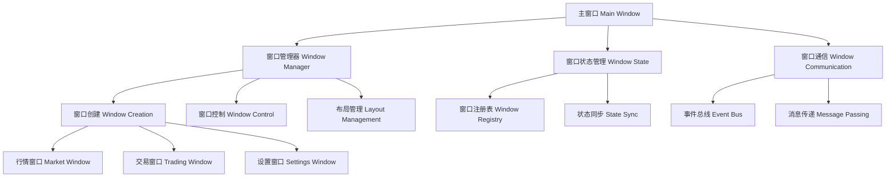
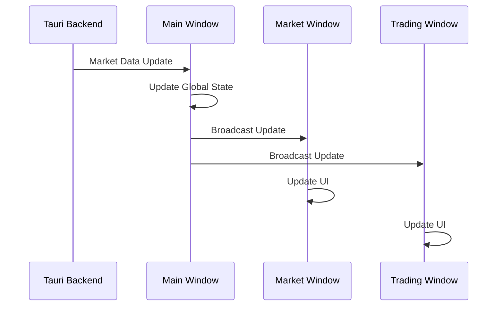
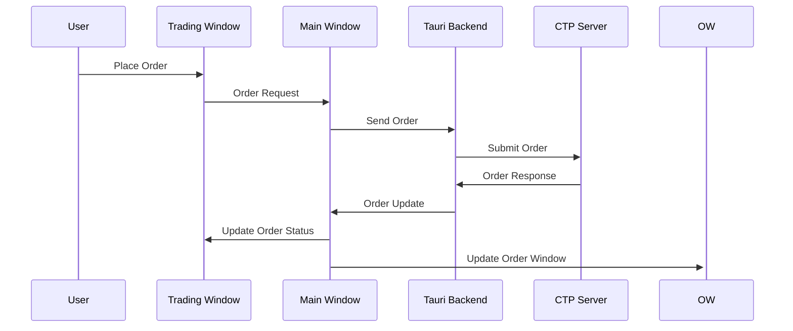

# 前端现代化重塑设计文档

## 概述

本设计文档详细描述了期货交易平台前端现代化重塑的技术架构、组件设计和实现方案。新架构将采用多窗口设计模式，使用现代化的 UI 组件库，提供更灵活和高性能的用户体验。

## 架构设计

### 多窗口管理核心架构



### 第一阶段：多窗口管理系统

重点实现多窗口的核心管理功能，包括窗口创建、控制、状态管理和基本通信。其他功能（如复杂的 UI 组件、图表等）将在后续阶段实现。

### 技术栈选择

#### 核心框架
- **Tauri 2.0**: 跨平台桌面应用框架，支持多窗口
- **React 18+**: 前端框架，支持并发特性
- **TypeScript**: 类型安全的 JavaScript 超集
- **Vite**: 快速构建工具
- **Bun**: 高性能包管理器和运行时

#### UI 组件库
- **shadcn/ui**: 现代化 UI 组件库，基于 Radix UI
- **Tailwind CSS**: 原子化 CSS 框架
- **Lucide React**: 现代化图标库
- **Framer Motion**: 流畅动画库（谨慎使用）

#### 状态管理
- **Zustand**: 轻量级状态管理库
- **React Query/TanStack Query**: 服务端状态管理
- **Jotai**: 原子化状态管理（用于窗口间状态同步）

#### 图表和可视化
- **TradingView Charting Library**: 专业金融图表
- **Recharts**: React 图表库
- **D3.js**: 自定义可视化（按需使用）

## 组件设计

### 多窗口管理系统核心设计

#### 窗口配置接口
```typescript
interface WindowConfig {
  id: string;
  type: WindowType;
  title: string;
  url: string; // 窗口加载的页面路径
  size: { width: number; height: number };
  position?: { x: number; y: number };
  resizable: boolean;
  minimizable: boolean;
  maximizable: boolean;
  alwaysOnTop?: boolean;
  parent?: string; // 父窗口ID
  data?: Record<string, any>; // 传递给窗口的数据
}

enum WindowType {
  MAIN = 'main',
  MARKET = 'market',
  TRADING = 'trading',
  SETTINGS = 'settings',
  TEST = 'test' // 用于测试的简单窗口类型
}

interface WindowState {
  config: WindowConfig;
  isVisible: boolean;
  isMinimized: boolean;
  isMaximized: boolean;
  lastActiveTime: number;
  createdAt: number;
}
```

#### WindowManager 核心类
```typescript
class WindowManager {
  private windows: Map<string, WindowState>;
  private eventBus: EventBus;
  private tauriApi: any; // Tauri API 引用
  
  constructor() {
    this.windows = new Map();
    this.eventBus = new EventBus();
    this.initializeTauriApi();
  }
  
  // 核心窗口操作方法
  async createWindow(config: WindowConfig): Promise<string>;
  async closeWindow(windowId: string): Promise<void>;
  async focusWindow(windowId: string): Promise<void>;
  async minimizeWindow(windowId: string): Promise<void>;
  async maximizeWindow(windowId: string): Promise<void>;
  async hideWindow(windowId: string): Promise<void>;
  async showWindow(windowId: string): Promise<void>;
  
  // 窗口查询方法
  getWindow(windowId: string): WindowState | undefined;
  getWindowList(): WindowState[];
  getWindowsByType(type: WindowType): WindowState[];
  isWindowOpen(windowId: string): boolean;
  
  // 窗口状态管理
  updateWindowState(windowId: string, updates: Partial<WindowState>): void;
  registerWindow(windowId: string, state: WindowState): void;
  unregisterWindow(windowId: string): void;
  
  // 布局管理
  saveWindowLayout(layoutName: string): Promise<void>;
  restoreWindowLayout(layoutName: string): Promise<void>;
  getAvailableLayouts(): string[];
  
  // 事件处理
  onWindowCreated(callback: (windowId: string) => void): void;
  onWindowClosed(callback: (windowId: string) => void): void;
  onWindowFocused(callback: (windowId: string) => void): void;
}
```

#### 窗口通信系统
```typescript
interface WindowMessage {
  id: string;
  type: string;
  source: string;
  target: string;
  data: any;
  timestamp: number;
}

class WindowCommunication {
  private eventBus: EventBus;
  private messageQueue: Map<string, WindowMessage[]>;
  
  constructor(eventBus: EventBus) {
    this.eventBus = eventBus;
    this.messageQueue = new Map();
    this.setupMessageHandlers();
  }
  
  // 发送消息到指定窗口
  sendMessage(targetWindowId: string, type: string, data: any): void;
  
  // 广播消息到所有窗口
  broadcastMessage(type: string, data: any): void;
  
  // 监听特定类型的消息
  onMessage(type: string, callback: (message: WindowMessage) => void): void;
  
  // 请求-响应模式
  sendRequest(targetWindowId: string, type: string, data: any): Promise<any>;
  
  private setupMessageHandlers(): void;
  private handleIncomingMessage(message: WindowMessage): void;
}
```

#### 主窗口设计（第一阶段简化版）
```typescript
interface MainWindowProps {
  windowManager: WindowManager;
}

const MainWindow: React.FC<MainWindowProps> = ({ windowManager }) => {
  const [openWindows, setOpenWindows] = useState<WindowState[]>([]);
  
  useEffect(() => {
    // 监听窗口变化
    windowManager.onWindowCreated((windowId) => {
      setOpenWindows(windowManager.getWindowList());
    });
    
    windowManager.onWindowClosed((windowId) => {
      setOpenWindows(windowManager.getWindowList());
    });
  }, [windowManager]);
  
  return (
    <div className="main-window p-4">
      <header className="mb-4">
        <h1 className="text-2xl font-bold">Inspirai Trader - 窗口管理中心</h1>
      </header>
      
      <div className="main-content">
        <WindowControlPanel 
          windowManager={windowManager}
          openWindows={openWindows}
        />
        
        <QuickCreateButtons windowManager={windowManager} />
        
        <WindowStatusList openWindows={openWindows} />
      </div>
    </div>
  );
};

// 窗口控制面板
const WindowControlPanel: React.FC<{
  windowManager: WindowManager;
  openWindows: WindowState[];
}> = ({ windowManager, openWindows }) => {
  return (
    <div className="window-control-panel mb-6">
      <h2 className="text-lg font-semibold mb-3">窗口控制</h2>
      <div className="grid grid-cols-2 md:grid-cols-4 gap-2">
        {openWindows.map(window => (
          <WindowControlCard 
            key={window.config.id}
            window={window}
            windowManager={windowManager}
          />
        ))}
      </div>
    </div>
  );
};

// 快速创建按钮
const QuickCreateButtons: React.FC<{
  windowManager: WindowManager;
}> = ({ windowManager }) => {
  const createTestWindow = async () => {
    const config: WindowConfig = {
      id: `test-${Date.now()}`,
      type: WindowType.TEST,
      title: '测试窗口',
      url: '/test-window',
      size: { width: 400, height: 300 },
      resizable: true,
      minimizable: true,
      maximizable: true,
    };
    
    await windowManager.createWindow(config);
  };
  
  const createMarketWindow = async () => {
    const config: WindowConfig = {
      id: `market-${Date.now()}`,
      type: WindowType.MARKET,
      title: '行情窗口',
      url: '/market-window',
      size: { width: 800, height: 600 },
      resizable: true,
      minimizable: true,
      maximizable: true,
    };
    
    await windowManager.createWindow(config);
  };
  
  return (
    <div className="quick-create-buttons mb-6">
      <h2 className="text-lg font-semibold mb-3">快速创建窗口</h2>
      <div className="flex gap-2">
        <button 
          onClick={createTestWindow}
          className="px-4 py-2 bg-blue-500 text-white rounded hover:bg-blue-600"
        >
          创建测试窗口
        </button>
        <button 
          onClick={createMarketWindow}
          className="px-4 py-2 bg-green-500 text-white rounded hover:bg-green-600"
        >
          创建行情窗口
        </button>
      </div>
    </div>
  );
};
```

### 状态管理架构

#### 全局状态设计
```typescript
// 主状态 Store
interface AppState {
  windows: WindowState;
  connection: ConnectionState;
  account: AccountState;
  market: MarketState;
  trading: TradingState;
  ui: UIState;
}

// 窗口状态
interface WindowState {
  openWindows: Map<string, WindowConfig>;
  activeWindow: string | null;
  layouts: WindowLayout[];
  currentLayout: string;
}

// 连接状态
interface ConnectionState {
  status: ConnectionStatus;
  servers: ServerConfig[];
  currentServer: string | null;
  lastHeartbeat: number | null;
}

// 市场数据状态
interface MarketState {
  subscriptions: Map<string, SubscriptionInfo>;
  ticks: Map<string, MarketTick>;
  klineData: Map<string, KlineData[]>;
  watchlist: string[];
}
```

#### 窗口间状态同步
```typescript
// 使用 Jotai 实现窗口间状态同步
import { atom, useAtom } from 'jotai';

// 全局原子状态
export const marketDataAtom = atom<Map<string, MarketTick>>(new Map());
export const accountInfoAtom = atom<AccountInfo | null>(null);
export const connectionStatusAtom = atom<ConnectionStatus>(ConnectionStatus.DISCONNECTED);

// 窗口间通信
class WindowCommunication {
  private eventBus: EventBus;
  
  constructor() {
    this.eventBus = new EventBus();
    this.setupEventListeners();
  }
  
  private setupEventListeners() {
    // 监听市场数据更新
    this.eventBus.on('market-data-update', (data: MarketTick) => {
      // 广播到所有窗口
      this.broadcastToAllWindows('market-data-update', data);
    });
    
    // 监听账户信息更新
    this.eventBus.on('account-update', (data: AccountInfo) => {
      this.broadcastToAllWindows('account-update', data);
    });
  }
  
  private async broadcastToAllWindows(event: string, data: any) {
    const windows = await windowManager.getWindowList();
    windows.forEach(window => {
      if (window.id !== 'main') {
        this.sendToWindow(window.id, event, data);
      }
    });
  }
}
```

### UI 组件设计

#### 基础组件库
```typescript
// 基于 shadcn/ui 的自定义组件
export const TradingCard = ({ children, title, ...props }: CardProps) => (
  <Card className="trading-card" {...props}>
    <CardHeader>
      <CardTitle>{title}</CardTitle>
    </CardHeader>
    <CardContent>{children}</CardContent>
  </Card>
);

export const PriceDisplay = ({ 
  price, 
  change, 
  precision = 2 
}: PriceDisplayProps) => {
  const changeColor = change > 0 ? 'text-green-500' : 
                     change < 0 ? 'text-red-500' : 'text-gray-500';
  
  return (
    <div className="price-display">
      <span className="text-2xl font-mono">{price.toFixed(precision)}</span>
      <span className={`ml-2 ${changeColor}`}>
        {change > 0 ? '+' : ''}{change.toFixed(precision)}
      </span>
    </div>
  );
};

export const OrderButton = ({ 
  type, 
  onClick, 
  disabled 
}: OrderButtonProps) => (
  <Button
    variant={type === 'buy' ? 'default' : 'destructive'}
    onClick={onClick}
    disabled={disabled}
    className="order-button"
  >
    {type === 'buy' ? '买入' : '卖出'}
  </Button>
);
```

#### 行情窗口组件
```typescript
interface MarketWindowProps {
  instrumentId: string;
  windowId: string;
}

const MarketWindow: React.FC<MarketWindowProps> = ({ 
  instrumentId, 
  windowId 
}) => {
  const [tick] = useAtom(marketDataAtom);
  const currentTick = tick.get(instrumentId);
  
  return (
    <div className="market-window">
      <WindowHeader 
        title={`${instrumentId} 行情`}
        windowId={windowId}
      />
      
      <div className="market-content">
        <PricePanel tick={currentTick} />
        <DepthChart instrumentId={instrumentId} />
        <KlineChart instrumentId={instrumentId} />
        <TickList instrumentId={instrumentId} />
      </div>
    </div>
  );
};
```

#### 交易窗口组件
```typescript
const TradingWindow: React.FC<TradingWindowProps> = ({ windowId }) => {
  const [selectedInstrument, setSelectedInstrument] = useState('');
  const [orderForm] = Form.useForm();
  
  return (
    <div className="trading-window">
      <WindowHeader title="交易面板" windowId={windowId} />
      
      <div className="trading-content">
        <InstrumentSelector 
          value={selectedInstrument}
          onChange={setSelectedInstrument}
        />
        
        <OrderForm 
          form={orderForm}
          instrumentId={selectedInstrument}
        />
        
        <QuickOrderButtons instrumentId={selectedInstrument} />
        
        <RiskIndicator />
      </div>
    </div>
  );
};
```

## 数据流设计

### 实时数据流


### 订单流程


## 性能优化策略

### 渲染优化
1. **虚拟化列表**: 对于大量数据的列表使用 react-window
2. **React.memo**: 对纯组件使用 memo 避免不必要的重渲染
3. **useMemo/useCallback**: 缓存计算结果和函数引用
4. **懒加载**: 窗口内容按需加载

### 内存管理
1. **数据清理**: 定期清理过期的市场数据
2. **窗口销毁**: 关闭窗口时清理相关资源
3. **事件监听器**: 及时移除不需要的事件监听器

### 网络优化
1. **数据压缩**: 使用 WebSocket 压缩传输
2. **批量更新**: 合并多个小的更新请求
3. **智能订阅**: 根据窗口可见性动态调整订阅

## 错误处理

### 错误边界设计
```typescript
class WindowErrorBoundary extends React.Component<
  ErrorBoundaryProps,
  ErrorBoundaryState
> {
  constructor(props: ErrorBoundaryProps) {
    super(props);
    this.state = { hasError: false, error: null };
  }
  
  static getDerivedStateFromError(error: Error): ErrorBoundaryState {
    return { hasError: true, error };
  }
  
  componentDidCatch(error: Error, errorInfo: ErrorInfo) {
    // 记录错误到日志系统
    logger.error('Window Error:', error, errorInfo);
    
    // 发送错误报告
    errorReporter.report(error, {
      windowId: this.props.windowId,
      context: errorInfo
    });
  }
  
  render() {
    if (this.state.hasError) {
      return (
        <ErrorFallback 
          error={this.state.error}
          onRetry={() => this.setState({ hasError: false, error: null })}
        />
      );
    }
    
    return this.props.children;
  }
}
```

### 网络错误处理
```typescript
class NetworkErrorHandler {
  private retryCount = 0;
  private maxRetries = 3;
  
  async handleConnectionError(error: NetworkError) {
    if (this.retryCount < this.maxRetries) {
      this.retryCount++;
      await this.delay(1000 * this.retryCount);
      return this.reconnect();
    }
    
    // 显示错误提示
    toast.error('网络连接失败，请检查网络设置');
    
    // 切换到离线模式
    store.dispatch(setOfflineMode(true));
  }
  
  private delay(ms: number): Promise<void> {
    return new Promise(resolve => setTimeout(resolve, ms));
  }
}
```

## 测试策略

### 单元测试
- 使用 Vitest 进行单元测试
- 测试覆盖率目标：80%+
- 重点测试状态管理和业务逻辑

### 集成测试
- 使用 Playwright 进行端到端测试
- 测试多窗口交互场景
- 测试数据同步功能

### 性能测试
- 使用 React DevTools Profiler
- 监控内存使用情况
- 测试大量数据场景下的性能

## 部署和构建

### 构建配置
```typescript
// vite.config.ts
export default defineConfig({
  plugins: [react(), tauriPlugin()],
  build: {
    target: 'esnext',
    minify: 'esbuild',
    rollupOptions: {
      output: {
        manualChunks: {
          vendor: ['react', 'react-dom'],
          ui: ['@radix-ui/react-dialog', '@radix-ui/react-dropdown-menu'],
          charts: ['lightweight-charts', 'recharts']
        }
      }
    }
  },
  optimizeDeps: {
    include: ['react', 'react-dom', 'zustand']
  }
});
```

### Tauri 配置
```json
{
  "windows": [
    {
      "label": "main",
      "title": "Inspirai Trader",
      "width": 1200,
      "height": 800,
      "minWidth": 800,
      "minHeight": 600,
      "resizable": true,
      "fullscreen": false
    }
  ],
  "security": {
    "csp": "default-src 'self'; script-src 'self' 'unsafe-inline'; style-src 'self' 'unsafe-inline'"
  }
}
```

## 迁移策略

### 数据迁移
1. **配置迁移**: 从旧版本导入用户设置
2. **布局迁移**: 转换旧的布局配置到新的窗口系统
3. **数据备份**: 迁移前自动备份用户数据

### 渐进式迁移
1. **功能对等**: 确保新版本包含所有旧版本功能
2. **并行运行**: 支持新旧版本并行运行一段时间
3. **用户培训**: 提供迁移指南和使用教程

## 安全考虑

### 窗口安全
- 防止窗口劫持
- 限制窗口间的数据访问权限
- 加密敏感数据传输

### 数据安全
- 本地数据加密存储
- 网络传输使用 TLS
- 定期清理敏感数据

这个设计文档提供了完整的技术架构和实现方案，为前端现代化重塑项目提供了详细的指导。