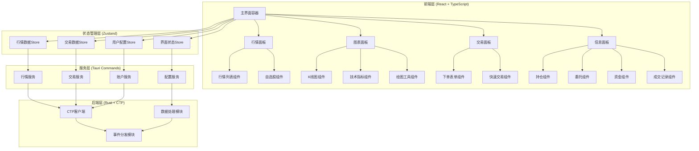
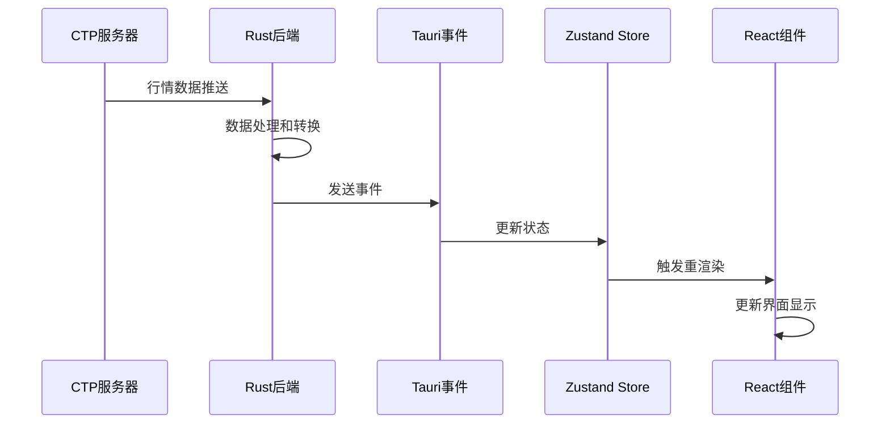

# 期货交易界面设计文档

## 概述

本设计文档基于需求文档，详细描述了期货交易界面系统的架构设计、组件结构、数据流和技术实现方案。系统采用 React + TypeScript + Tauri2 架构，使用 Bun 作为包管理器，提供高性能的桌面期货交易应用。

## 架构设计

### 整体架构



### 技术栈选择

- **前端框架**: React 18+ with TypeScript
- **状态管理**: Zustand (轻量级，性能优秀)
- **UI组件库**: Ant Design (专业的企业级UI)
- **图表库**: TradingView Charting Library (专业金融图表)
- **样式方案**: Tailwind CSS + CSS Modules
- **包管理器**: Bun (高性能)
- **桌面框架**: Tauri2 (安全、轻量)
- **后端语言**: Rust (高性能、内存安全)

## 组件设计

### 1. 主界面布局组件 (TradingLayout)

```typescript
interface TradingLayoutProps {
  children: React.ReactNode;
  layout: LayoutConfig;
  onLayoutChange: (layout: LayoutConfig) => void;
}

interface LayoutConfig {
  panels: {
    market: PanelConfig;
    chart: PanelConfig;
    trading: PanelConfig;
    info: PanelConfig;
  };
  theme: 'dark' | 'light';
  customColors: ColorScheme;
}

interface PanelConfig {
  visible: boolean;
  position: { x: number; y: number };
  size: { width: number; height: number };
  minSize: { width: number; height: number };
  resizable: boolean;
  draggable: boolean;
}
```

**设计特点:**
- 使用 CSS Grid 实现响应式布局
- 支持面板拖拽和调整大小
- 布局配置持久化存储
- 支持预设布局模板

### 2. 实时行情组件 (MarketDataPanel)

```typescript
interface MarketDataPanelProps {
  contracts: ContractInfo[];
  selectedContract: string;
  onContractSelect: (contractId: string) => void;
  onAddToWatchlist: (contractId: string) => void;
}

interface MarketTick {
  contractId: string;
  lastPrice: number;
  change: number;
  changePercent: number;
  volume: number;
  openInterest: number;
  bidPrice: number;
  askPrice: number;
  bidVolume: number;
  askVolume: number;
  timestamp: number;
}
```

**设计特点:**
- 虚拟滚动处理大量行情数据
- 价格变动动画效果
- 自定义排序和筛选
- 实时数据更新优化

### 3. K线图表组件 (ChartPanel)

```typescript
interface ChartPanelProps {
  contractId: string;
  timeframe: TimeFrame;
  indicators: TechnicalIndicator[];
  onTimeframeChange: (timeframe: TimeFrame) => void;
  onIndicatorAdd: (indicator: TechnicalIndicator) => void;
}

interface ChartData {
  timestamp: number;
  open: number;
  high: number;
  low: number;
  close: number;
  volume: number;
}

enum TimeFrame {
  M1 = '1m',
  M5 = '5m',
  M15 = '15m',
  M30 = '30m',
  H1 = '1h',
  H4 = '4h',
  D1 = '1d'
}
```

**设计特点:**
- 集成 TradingView Charting Library
- 支持多种图表类型和技术指标
- 绘图工具和标注功能
- 图表数据缓存和增量更新

### 4. 交易下单组件 (TradingPanel)

```typescript
interface TradingPanelProps {
  selectedContract: ContractInfo;
  accountInfo: AccountInfo;
  onOrderSubmit: (order: OrderRequest) => void;
}

interface OrderRequest {
  contractId: string;
  direction: 'BUY' | 'SELL';
  offsetFlag: 'OPEN' | 'CLOSE' | 'CLOSE_TODAY' | 'CLOSE_YESTERDAY';
  orderType: 'LIMIT' | 'MARKET' | 'STOP' | 'STOP_LIMIT';
  price?: number;
  volume: number;
  timeInForce: 'GTC' | 'IOC' | 'FOK';
  stopPrice?: number;
  takeProfitPrice?: number;
}
```

**设计特点:**
- 智能下单参数验证
- 实时保证金和手续费计算
- 一键平仓和反手功能
- 风险提示和确认机制

### 5. 持仓管理组件 (PositionPanel)

```typescript
interface PositionPanelProps {
  positions: Position[];
  onClosePosition: (positionId: string, volume?: number) => void;
  onSetStopLoss: (positionId: string, price: number) => void;
}

interface Position {
  positionId: string;
  contractId: string;
  direction: 'LONG' | 'SHORT';
  volume: number;
  openPrice: number;
  currentPrice: number;
  unrealizedPnL: number;
  margin: number;
  openTime: number;
  holdingDays: number;
}
```

**设计特点:**
- 实时盈亏计算和显示
- 持仓风险等级标识
- 批量操作支持
- 持仓分析图表

## 数据流设计

### 状态管理架构

```typescript
// 行情数据状态
interface MarketDataStore {
  ticks: Map<string, MarketTick>;
  klineData: Map<string, ChartData[]>;
  subscriptions: Set<string>;
  connectionStatus: ConnectionStatus;
  
  // Actions
  updateTick: (tick: MarketTick) => void;
  updateKline: (contractId: string, data: ChartData[]) => void;
  subscribe: (contractId: string) => void;
  unsubscribe: (contractId: string) => void;
}

// 交易数据状态
interface TradingStore {
  orders: Order[];
  positions: Position[];
  trades: Trade[];
  accountInfo: AccountInfo;
  
  // Actions
  submitOrder: (order: OrderRequest) => Promise<void>;
  cancelOrder: (orderId: string) => Promise<void>;
  updatePosition: (position: Position) => void;
  updateAccount: (account: AccountInfo) => void;
}

// 界面配置状态
interface UIStore {
  layout: LayoutConfig;
  theme: ThemeConfig;
  preferences: UserPreferences;
  
  // Actions
  updateLayout: (layout: LayoutConfig) => void;
  switchTheme: (theme: 'dark' | 'light') => void;
  savePreferences: (prefs: UserPreferences) => void;
}
```

### 数据更新流程



## 界面设计规范

### 色彩方案

```css
/* 深色主题 */
:root[data-theme="dark"] {
  --bg-primary: #0a0a0a;
  --bg-secondary: #1a1a1a;
  --bg-tertiary: #2a2a2a;
  
  --text-primary: #ffffff;
  --text-secondary: #cccccc;
  --text-muted: #888888;
  
  --color-up: #00d4aa;      /* 涨 - 绿色 */
  --color-down: #ff4d4f;    /* 跌 - 红色 */
  --color-neutral: #faad14; /* 平 - 黄色 */
  
  --border-color: #3a3a3a;
  --hover-color: #4a4a4a;
  --active-color: #1890ff;
}

/* 浅色主题 */
:root[data-theme="light"] {
  --bg-primary: #ffffff;
  --bg-secondary: #f5f5f5;
  --bg-tertiary: #e8e8e8;
  
  --text-primary: #000000;
  --text-secondary: #333333;
  --text-muted: #666666;
  
  --color-up: #52c41a;      /* 涨 - 绿色 */
  --color-down: #f5222d;    /* 跌 - 红色 */
  --color-neutral: #faad14; /* 平 - 黄色 */
  
  --border-color: #d9d9d9;
  --hover-color: #f0f0f0;
  --active-color: #1890ff;
}
```

### 字体规范

```css
/* 数字字体 - 等宽 */
.font-mono {
  font-family: 'SF Mono', 'Monaco', 'Inconsolata', 'Roboto Mono', monospace;
}

/* 中文字体 */
.font-sans {
  font-family: -apple-system, BlinkMacSystemFont, 'Segoe UI', 'PingFang SC', 
               'Hiragino Sans GB', 'Microsoft YaHei', 'Helvetica Neue', 
               Helvetica, Arial, sans-serif;
}

/* 字体大小 */
.text-xs { font-size: 12px; }    /* 小字 */
.text-sm { font-size: 13px; }    /* 数据 */
.text-base { font-size: 14px; }  /* 正文 */
.text-lg { font-size: 16px; }    /* 标题 */
.text-xl { font-size: 18px; }    /* 大标题 */
```

### 布局规范

```css
/* 面板间距 */
.panel-gap { gap: 4px; }
.panel-padding { padding: 8px; }
.panel-margin { margin: 4px; }

/* 面板边框 */
.panel-border {
  border: 1px solid var(--border-color);
  border-radius: 4px;
}

/* 响应式断点 */
@media (max-width: 768px) {
  .mobile-hidden { display: none; }
  .mobile-stack { flex-direction: column; }
}

@media (max-width: 1024px) {
  .tablet-compact { padding: 4px; }
  .tablet-small { font-size: 12px; }
}
```

## 性能优化策略

### 1. 数据更新优化

- **防抖处理**: 行情数据更新使用防抖，避免过度渲染
- **批量更新**: 多个数据变更合并为单次状态更新
- **增量更新**: 只更新变化的数据，避免全量刷新
- **虚拟滚动**: 大列表使用虚拟滚动技术

### 2. 内存管理

- **数据清理**: 定期清理过期的历史数据
- **缓存策略**: 智能缓存常用数据，LRU淘汰机制
- **对象池**: 复用频繁创建的对象
- **弱引用**: 使用WeakMap存储临时数据

### 3. 渲染优化

- **React.memo**: 包装纯组件避免不必要渲染
- **useMemo/useCallback**: 缓存计算结果和回调函数
- **代码分割**: 按需加载非核心功能模块
- **Web Workers**: 复杂计算移至后台线程

## 错误处理策略

### 1. 网络错误处理

```typescript
interface ErrorBoundaryState {
  hasError: boolean;
  error?: Error;
  errorInfo?: ErrorInfo;
}

class TradingErrorBoundary extends Component<Props, ErrorBoundaryState> {
  static getDerivedStateFromError(error: Error): ErrorBoundaryState {
    return { hasError: true, error };
  }
  
  componentDidCatch(error: Error, errorInfo: ErrorInfo) {
    // 记录错误日志
    console.error('Trading UI Error:', error, errorInfo);
    
    // 发送错误报告
    this.reportError(error, errorInfo);
  }
}
```

### 2. 数据异常处理

- **数据验证**: 所有外部数据进行格式验证
- **默认值**: 提供合理的默认值和降级显示
- **重试机制**: 网络请求失败自动重试
- **用户提示**: 友好的错误信息和操作建议

## 测试策略

### 1. 单元测试

```typescript
// 组件测试示例
describe('MarketDataPanel', () => {
  it('should render market data correctly', () => {
    const mockData = createMockMarketData();
    render(<MarketDataPanel data={mockData} />);
    
    expect(screen.getByText(mockData.lastPrice)).toBeInTheDocument();
    expect(screen.getByText(mockData.changePercent)).toBeInTheDocument();
  });
  
  it('should handle price updates', async () => {
    const { rerender } = render(<MarketDataPanel data={initialData} />);
    
    const updatedData = { ...initialData, lastPrice: 3500 };
    rerender(<MarketDataPanel data={updatedData} />);
    
    await waitFor(() => {
      expect(screen.getByText('3500')).toBeInTheDocument();
    });
  });
});
```

### 2. 集成测试

- **端到端测试**: 使用 Playwright 测试完整交易流程
- **性能测试**: 测试大量数据下的界面响应性能
- **兼容性测试**: 测试不同操作系统和屏幕分辨率

### 3. 用户体验测试

- **可访问性测试**: 确保键盘导航和屏幕阅读器支持
- **响应式测试**: 测试不同屏幕尺寸下的布局
- **交互测试**: 验证所有用户交互的反馈和状态