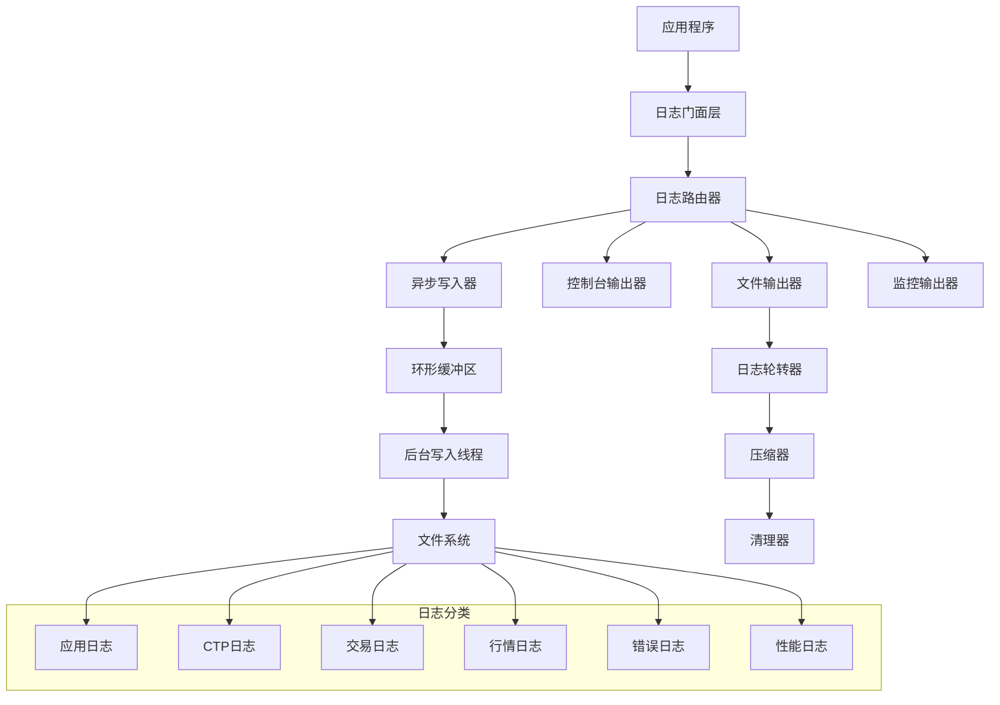

# 日志系统设计文档

## 概述

本文档描述了期货交易系统的日志架构设计，采用分层、异步、结构化的设计理念，确保在高频交易环境下的性能表现，同时提供强大的查询和分析能力。

## 架构设计

### 整体架构图



### 核心组件设计

#### 1. 日志门面层 (Log Facade)
- **职责**: 提供统一的日志接口，屏蔽底层实现细节
- **技术选型**: 使用 `tracing` crate 作为 Rust 端的日志门面
- **接口设计**:
```rust
pub trait Logger {
    fn trace(&self, message: &str, context: LogContext);
    fn debug(&self, message: &str, context: LogContext);
    fn info(&self, message: &str, context: LogContext);
    fn warn(&self, message: &str, context: LogContext);
    fn error(&self, message: &str, context: LogContext);
}
```

#### 2. 日志路由器 (Log Router)
- **职责**: 根据日志类型和级别将日志分发到不同的输出器
- **路由规则**:
  - CTP 相关日志 → ctp.log
  - 交易操作日志 → trading.log
  - 行情数据日志 → market_data.log
  - 错误级别日志 → error.log + 对应业务日志
  - 性能监控日志 → performance.log

#### 3. 异步写入器 (Async Writer)
- **技术实现**: 使用 `tokio::sync::mpsc` 实现生产者-消费者模式
- **缓冲策略**: 环形缓冲区 + 批量写入
- **性能优化**: 
  - 缓冲区大小: 64KB
  - 批量写入阈值: 1000条或100ms
  - 背压处理: 缓冲区满时丢弃最旧的日志

## 组件和接口

### 日志上下文结构

```rust
#[derive(Debug, Clone, Serialize)]
pub struct LogContext {
    pub timestamp: DateTime<Utc>,
    pub level: LogLevel,
    pub module: String,
    pub thread_id: String,
    pub request_id: Option<String>,
    pub user_id: Option<String>,
    pub session_id: Option<String>,
    pub extra: HashMap<String, Value>,
}

#[derive(Debug, Clone, Serialize)]
pub struct TradingLogContext {
    pub account_id: String,
    pub instrument_id: String,
    pub order_ref: Option<String>,
    pub direction: Option<String>,
    pub offset_flag: Option<String>,
    pub price: Option<f64>,
    pub volume: Option<i32>,
}

#[derive(Debug, Clone, Serialize)]
pub struct CtpLogContext {
    pub api_type: String, // "MD" | "Trader"
    pub request_id: i32,
    pub error_id: Option<i32>,
    pub error_msg: Option<String>,
    pub response_time: Option<Duration>,
}
```

### 日志格式规范

#### JSON 格式（结构化日志）
```json
{
  "timestamp": "2024-01-15T10:30:45.123Z",
  "level": "INFO",
  "module": "trading_service",
  "thread": "tokio-runtime-worker-1",
  "message": "订单提交成功",
  "context": {
    "account_id": "123456789",
    "instrument_id": "rb2405",
    "order_ref": "000001",
    "direction": "BUY",
    "price": 3850.0,
    "volume": 1
  },
  "request_id": "req_001",
  "session_id": "sess_abc123"
}
```

#### 人类可读格式（控制台输出）
```
2024-01-15 18:30:45.123 [INFO ] [trading_service] 订单提交成功 account_id=123456789 instrument_id=rb2405 order_ref=000001
```

### 配置管理

```rust
#[derive(Debug, Clone, Deserialize)]
pub struct LogConfig {
    pub level: LogLevel,
    pub output_dir: PathBuf,
    pub console_output: bool,
    pub file_output: bool,
    pub max_file_size: u64,        // 50MB
    pub max_files: usize,          // 30 files
    pub compression_enabled: bool,
    pub retention_days: u32,       // 90 days
    pub async_buffer_size: usize,  // 64KB
    pub batch_size: usize,         // 1000 entries
    pub flush_interval: Duration,  // 100ms
}

impl LogConfig {
    pub fn development() -> Self {
        Self {
            level: LogLevel::Debug,
            output_dir: PathBuf::from("./logs"),
            console_output: true,
            file_output: true,
            // ... 其他开发环境配置
        }
    }
    
    pub fn production() -> Self {
        Self {
            level: LogLevel::Info,
            output_dir: Self::get_user_data_dir().join("logs"),
            console_output: false,
            file_output: true,
            // ... 其他生产环境配置
        }
    }
}
```

## 数据模型

### 日志文件组织结构

```
logs/
├── app/
│   ├── app.2024-01-15.log
│   ├── app.2024-01-15.1.log
│   └── app.2024-01-14.log.gz
├── ctp/
│   ├── ctp.2024-01-15.log
│   └── ctp.2024-01-14.log.gz
├── trading/
│   ├── trading.2024-01-15.log
│   └── trading.2024-01-14.log.gz
├── market_data/
│   ├── market_data.2024-01-15.log
│   └── market_data.2024-01-14.log.gz
├── error/
│   ├── error.2024-01-15.log
│   └── error.2024-01-14.log.gz
├── performance/
│   ├── performance.2024-01-15.log
│   └── performance.2024-01-14.log.gz
└── archive/
    ├── 2024-01/
    └── 2024-02/
```

### 日志索引设计

为了支持快速查询，设计轻量级索引：

```rust
#[derive(Debug, Serialize, Deserialize)]
pub struct LogIndex {
    pub file_path: PathBuf,
    pub start_time: DateTime<Utc>,
    pub end_time: DateTime<Utc>,
    pub log_count: u64,
    pub size_bytes: u64,
    pub checksum: String,
}

#[derive(Debug, Serialize, Deserialize)]
pub struct LogIndexManager {
    pub indices: Vec<LogIndex>,
    pub last_updated: DateTime<Utc>,
}
```

## 错误处理

### 错误类型定义

```rust
#[derive(Debug, thiserror::Error)]
pub enum LogError {
    #[error("日志文件写入失败: {0}")]
    WriteError(#[from] std::io::Error),
    
    #[error("日志目录创建失败: {path}")]
    DirectoryCreationError { path: PathBuf },
    
    #[error("日志轮转失败: {reason}")]
    RotationError { reason: String },
    
    #[error("日志压缩失败: {file}")]
    CompressionError { file: PathBuf },
    
    #[error("磁盘空间不足: 可用空间 {available_mb}MB")]
    InsufficientDiskSpace { available_mb: u64 },
    
    #[error("日志配置无效: {field}")]
    InvalidConfig { field: String },
}
```

### 降级策略

1. **主日志路径不可用**: 切换到临时目录
2. **磁盘空间不足**: 启用紧急清理模式
3. **写入性能下降**: 降低日志级别，减少输出
4. **异步队列满**: 丢弃非关键日志，保留错误和交易日志

## 测试策略

### 单元测试
- 日志格式化测试
- 路由规则测试
- 配置解析测试
- 错误处理测试

### 集成测试
- 文件轮转测试
- 压缩和清理测试
- 并发写入测试
- 性能基准测试

### 压力测试
- 高频日志写入测试（10000 logs/sec）
- 大文件处理测试（>1GB）
- 长时间运行稳定性测试（24小时）
- 内存泄漏检测

### 测试数据生成

```rust
pub struct LogTestDataGenerator {
    pub trading_logs_per_second: u32,
    pub market_data_logs_per_second: u32,
    pub error_rate_percent: f32,
    pub duration_seconds: u32,
}

impl LogTestDataGenerator {
    pub fn generate_realistic_load(&self) -> Vec<LogEntry> {
        // 生成模拟真实交易场景的日志数据
    }
}
```

## 性能考虑

### 性能目标
- 日志写入延迟: < 1ms (P99)
- 吞吐量: > 50,000 logs/sec
- 内存使用: < 100MB
- CPU 使用: < 5% (单核)

### 优化策略

1. **批量写入**: 累积多条日志后一次性写入
2. **内存映射**: 对于大文件使用 mmap
3. **零拷贝**: 使用 `bytes` crate 减少内存分配
4. **预分配**: 预先分配缓冲区避免动态扩容
5. **SIMD 优化**: 对于日志解析使用 SIMD 指令

### 监控指标

```rust
#[derive(Debug, Clone)]
pub struct LogMetrics {
    pub logs_written_total: u64,
    pub logs_dropped_total: u64,
    pub write_latency_ms: Histogram,
    pub queue_size: Gauge,
    pub disk_usage_bytes: Gauge,
    pub error_count: Counter,
}
```

## 安全考虑

### 数据脱敏规则

```rust
pub struct DataMasker {
    patterns: Vec<MaskPattern>,
}

#[derive(Debug)]
pub struct MaskPattern {
    pub field_name: String,
    pub mask_type: MaskType,
}

#[derive(Debug)]
pub enum MaskType {
    FullMask,           // 完全隐藏
    PartialMask(usize), // 部分隐藏，保留前N位
    HashMask,           // 哈希处理
    Truncate(usize),    // 截断到N位
}
```

### 访问控制

- 日志文件权限: 600 (仅所有者可读写)
- 日志目录权限: 700 (仅所有者可访问)
- 进程隔离: 日志写入进程独立运行
- 审计日志: 记录日志系统本身的操作

### 合规要求

- 数据保留期限: 符合金融监管要求
- 审计跟踪: 完整的操作记录
- 数据完整性: 使用校验和验证
- 加密存储: 敏感日志可选择加密存储

## 部署和运维

### 环境配置

#### 开发环境
```toml
[logging]
level = "debug"
console_output = true
file_output = true
output_dir = "./logs"
async_enabled = false  # 同步模式便于调试
```

#### 生产环境
```toml
[logging]
level = "info"
console_output = false
file_output = true
output_dir = "~/Library/Application Support/InspirAI Trader/logs"
async_enabled = true
compression_enabled = true
retention_days = 90
```

### 运维工具

1. **日志查看器**: 内置的日志查看和搜索界面
2. **性能监控**: 实时监控日志系统性能指标
3. **健康检查**: 定期检查日志系统状态
4. **自动清理**: 定时清理过期日志文件

### 故障恢复

1. **自动重试**: 写入失败时自动重试
2. **备用路径**: 主路径不可用时使用备用路径
3. **状态恢复**: 系统重启后恢复日志状态
4. **数据修复**: 检测并修复损坏的日志文件