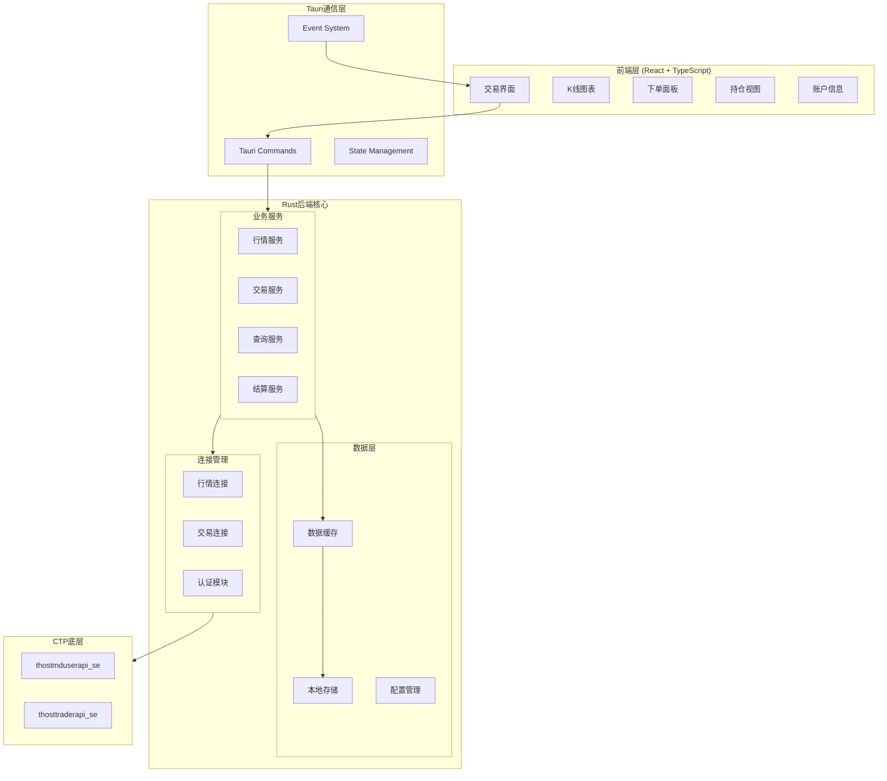

# CTP期货交易接入设计文档

## 概述

本设计文档描述了InspirAI Trader系统的CTP期货交易接入架构，重点关注功能完整性和系统稳定性。系统采用模块化设计，确保各功能组件清晰分离，便于开发、测试和维护。

## 架构设计

### 整体架构



### 核心设计原则

1. **功能完整性优先**: 确保所有CTP功能都能正确实现
2. **清晰的模块边界**: 每个模块职责单一，接口明确
3. **可测试性**: 支持单元测试和集成测试
4. **配置驱动**: 通过配置文件管理不同环境
5. **错误可恢复**: 完善的错误处理和恢复机制

## 组件设计

### 1. 连接管理模块

基于测试验证的连接流程：

```rust
pub struct ConnectionManager {
    md_connection: MdConnection,
    td_connection: TdConnection,
    config: CtpConfig,
    event_sender: mpsc::UnboundedSender<CtpEvent>,
}

pub struct MdConnection {
    api: Arc<MdApi>,
    spi: Box<MdSpiImpl>,
    state: ConnectionState,
    front_addr: String,
}

pub struct TdConnection {
    api: Arc<TraderApi>,
    spi: Box<TdSpiImpl>,
    state: ConnectionState,
    front_addr: String,
    auth_info: AuthInfo,
}

pub struct AuthInfo {
    broker_id: String,      // "5071"
    user_id: String,        // "00001"
    password: String,       // "abc123456"
    app_id: String,         // "inspirai_strategy_1.0.0"
    auth_code: String,      // "QHFK5E2GLEUB9XHV"
}
```

**连接流程实现**:

```rust
// 行情连接流程（无需认证）
impl MdConnection {
    pub fn connect(&mut self) -> Result<()> {
        // 1. 创建API实例
        self.api = MdApi::create_api(&self.config.md_lib_path, "ctp_md_flow", false, false);
        
        // 2. 注册SPI
        self.api.register_spi(&mut self.spi);
        
        // 3. 注册前置地址
        self.api.register_front(&self.front_addr);
        
        // 4. 初始化连接
        self.api.init();
        
        // 5. 等待连接成功回调
        // on_front_connected -> 直接登录
        Ok(())
    }
}

// 交易连接流程（需要认证）
impl TdConnection {
    pub fn connect(&mut self) -> Result<()> {
        // 1. 创建API实例
        self.api = TraderApi::create_api(&self.config.td_lib_path, "ctp_td_flow");
        
        // 2. 注册SPI
        self.api.register_spi(&mut self.spi);
        
        // 3. 注册前置地址
        self.api.register_front(&self.front_addr);
        
        // 4. 初始化连接
        self.api.init();
        
        // 5. 等待连接成功回调
        // on_front_connected -> 发送认证请求
        // on_rsp_authenticate -> 发送登录请求
        // on_rsp_user_login -> 确认结算单
        Ok(())
    }
}
```

### 2. 行情服务模块

```rust
pub struct MarketDataService {
    connection: Arc<Mutex<MdConnection>>,
    subscriptions: HashSet<String>,
    market_data: Arc<RwLock<HashMap<String, MarketData>>>,
    event_sender: broadcast::Sender<MarketEvent>,
}

impl MarketDataService {
    // 订阅合约
    pub async fn subscribe(&mut self, instruments: Vec<String>) -> Result<()> {
        let conn = self.connection.lock().await;
        conn.api.subscribe_market_data(&instruments)?;
        
        for inst in instruments {
            self.subscriptions.insert(inst);
        }
        Ok(())
    }
    
    // 处理行情回调
    pub fn on_market_data(&mut self, data: CThostFtdcDepthMarketDataField) {
        let market_data = self.convert_market_data(data);
        
        // 更新缓存
        self.market_data.write().unwrap()
            .insert(market_data.instrument_id.clone(), market_data.clone());
        
        // 发送事件
        let _ = self.event_sender.send(MarketEvent::DataUpdate(market_data));
    }
    
    // 数据转换（处理编码）
    fn convert_market_data(&self, data: CThostFtdcDepthMarketDataField) -> MarketData {
        MarketData {
            instrument_id: data.InstrumentID.to_string(),
            last_price: data.LastPrice,
            volume: data.Volume,
            bid_price1: data.BidPrice1,
            bid_volume1: data.BidVolume1,
            ask_price1: data.AskPrice1,
            ask_volume1: data.AskVolume1,
            update_time: format!("{} {}", 
                data.TradingDay.to_string(), 
                data.UpdateTime.to_string()),
            // 其他字段...
        }
    }
}
```

### 3. 交易服务模块

```rust
pub struct TradingService {
    connection: Arc<Mutex<TdConnection>>,
    order_manager: OrderManager,
    position_manager: PositionManager,
    risk_checker: RiskChecker,
    event_sender: broadcast::Sender<TradeEvent>,
}

pub struct OrderManager {
    active_orders: HashMap<String, OrderInfo>,
    order_ref_counter: AtomicI32,
    front_id: i32,
    session_id: i32,
}

impl TradingService {
    // 下单
    pub async fn place_order(&mut self, req: OrderRequest) -> Result<String> {
        // 1. 风险检查
        self.risk_checker.check(&req)?;
        
        // 2. 构建订单
        let mut order = CThostFtdcInputOrderField::default();
        order.BrokerID.assign_from_str(&self.config.broker_id);
        order.InvestorID.assign_from_str(&self.config.user_id);
        order.InstrumentID.assign_from_str(&req.instrument_id);
        
        // 生成订单引用
        let order_ref = self.order_manager.next_order_ref();
        order.OrderRef.assign_from_str(&order_ref);
        
        // 设置交易参数
        order.Direction = req.direction as i8;
        order.CombOffsetFlag[0] = req.offset as i8;
        order.CombHedgeFlag[0] = THOST_FTDC_HF_Speculation as i8;
        order.LimitPrice = req.price;
        order.VolumeTotalOriginal = req.volume;
        order.OrderPriceType = THOST_FTDC_OPT_LimitPrice as i8;
        order.TimeCondition = THOST_FTDC_TC_GFD as i8;
        order.VolumeCondition = THOST_FTDC_VC_AV as i8;
        order.MinVolume = 1;
        order.ContingentCondition = THOST_FTDC_CC_Immediately as i8;
        order.ForceCloseReason = THOST_FTDC_FCC_NotForceClose as i8;
        
        // 3. 发送订单
        let conn = self.connection.lock().await;
        conn.api.req_order_insert(&mut order, self.next_request_id())?;
        
        // 4. 记录订单
        self.order_manager.add_order(order_ref.clone(), req);
        
        Ok(order_ref)
    }
    
    // 撤单
    pub async fn cancel_order(&mut self, order_ref: &str) -> Result<()> {
        let order_info = self.order_manager.get_order(order_ref)
            .ok_or_else(|| CtpError::OrderNotFound)?;
        
        let mut action = CThostFtdcInputOrderActionField::default();
        action.BrokerID.assign_from_str(&self.config.broker_id);
        action.InvestorID.assign_from_str(&self.config.user_id);
        action.OrderRef.assign_from_str(&order_ref);
        action.FrontID = self.order_manager.front_id;
        action.SessionID = self.order_manager.session_id;
        action.ActionFlag = THOST_FTDC_AF_Delete as i8;
        
        let conn = self.connection.lock().await;
        conn.api.req_order_action(&mut action, self.next_request_id())?;
        
        Ok(())
    }
    
    // 处理订单回报
    pub fn on_order_update(&mut self, order: CThostFtdcOrderField) {
        let order_ref = order.OrderRef.to_string();
        
        // 更新订单状态
        if let Some(info) = self.order_manager.get_mut(&order_ref) {
            info.status = self.convert_order_status(order.OrderStatus);
            info.traded_volume = order.VolumeTraded;
            info.status_msg = gb18030_to_utf8(&order.StatusMsg);
        }
        
        // 发送事件
        let _ = self.event_sender.send(TradeEvent::OrderUpdate {
            order_ref,
            status: info.status,
            msg: info.status_msg,
        });
    }
}
```

### 4. 查询服务模块

```rust
pub struct QueryService {
    connection: Arc<Mutex<TdConnection>>,
    cache: QueryCache,
    request_id_counter: AtomicI32,
}

pub struct QueryCache {
    account: Option<AccountInfo>,
    positions: HashMap<String, PositionInfo>,
    orders: HashMap<String, OrderInfo>,
    trades: Vec<TradeInfo>,
    last_update: Instant,
}

impl QueryService {
    // 查询账户资金
    pub async fn query_account(&mut self) -> Result<AccountInfo> {
        let mut req = CThostFtdcQryTradingAccountField::default();
        req.BrokerID.assign_from_str(&self.config.broker_id);
        req.InvestorID.assign_from_str(&self.config.user_id);
        
        let conn = self.connection.lock().await;
        conn.api.req_qry_trading_account(&mut req, self.next_request_id())?;
        
        // 等待响应
        self.wait_for_response(Duration::from_secs(5)).await?;
        
        self.cache.account.clone()
            .ok_or_else(|| CtpError::QueryTimeout)
    }
    
    // 查询持仓
    pub async fn query_positions(&mut self) -> Result<Vec<PositionInfo>> {
        let mut req = CThostFtdcQryInvestorPositionField::default();
        req.BrokerID.assign_from_str(&self.config.broker_id);
        req.InvestorID.assign_from_str(&self.config.user_id);
        
        let conn = self.connection.lock().await;
        conn.api.req_qry_investor_position(&mut req, self.next_request_id())?;
        
        self.wait_for_response(Duration::from_secs(5)).await?;
        
        Ok(self.cache.positions.values().cloned().collect())
    }
    
    // 查询委托
    pub async fn query_orders(&mut self) -> Result<Vec<OrderInfo>> {
        let mut req = CThostFtdcQryOrderField::default();
        req.BrokerID.assign_from_str(&self.config.broker_id);
        req.InvestorID.assign_from_str(&self.config.user_id);
        
        let conn = self.connection.lock().await;
        conn.api.req_qry_order(&mut req, self.next_request_id())?;
        
        self.wait_for_response(Duration::from_secs(5)).await?;
        
        Ok(self.cache.orders.values().cloned().collect())
    }
}
```

### 5. 结算服务模块

```rust
pub struct SettlementService {
    connection: Arc<Mutex<TdConnection>>,
    settlement_info: Option<String>,
}

impl SettlementService {
    // 查询结算单
    pub async fn query_settlement(&mut self) -> Result<String> {
        let mut req = CThostFtdcQrySettlementInfoField::default();
        req.BrokerID.assign_from_str(&self.config.broker_id);
        req.InvestorID.assign_from_str(&self.config.user_id);
        req.TradingDay.assign_from_str(""); // 空表示当天
        
        let conn = self.connection.lock().await;
        conn.api.req_qry_settlement_info(&mut req, self.next_request_id())?;
        
        self.wait_for_response(Duration::from_secs(5)).await?;
        
        self.settlement_info.clone()
            .ok_or_else(|| CtpError::NoSettlementInfo)
    }
    
    // 确认结算单
    pub async fn confirm_settlement(&mut self) -> Result<()> {
        let mut req = CThostFtdcSettlementInfoConfirmField::default();
        req.BrokerID.assign_from_str(&self.config.broker_id);
        req.InvestorID.assign_from_str(&self.config.user_id);
        
        let conn = self.connection.lock().await;
        conn.api.req_settlement_info_confirm(&mut req, self.next_request_id())?;
        
        Ok(())
    }
}
```

## 数据模型

### 核心数据结构

```rust
// 行情数据
#[derive(Debug, Clone, Serialize, Deserialize)]
pub struct MarketData {
    pub instrument_id: String,
    pub last_price: f64,
    pub volume: i32,
    pub turnover: f64,
    pub bid_price1: f64,
    pub bid_volume1: i32,
    pub ask_price1: f64,
    pub ask_volume1: i32,
    pub update_time: String,
    pub trading_day: String,
}

// 订单信息
#[derive(Debug, Clone, Serialize, Deserialize)]
pub struct OrderInfo {
    pub order_ref: String,
    pub instrument_id: String,
    pub direction: Direction,
    pub offset: Offset,
    pub price: f64,
    pub volume: i32,
    pub traded_volume: i32,
    pub status: OrderStatus,
    pub status_msg: String,
    pub insert_time: String,
}

// 持仓信息
#[derive(Debug, Clone, Serialize, Deserialize)]
pub struct PositionInfo {
    pub instrument_id: String,
    pub direction: Direction,
    pub volume: i32,
    pub today_volume: i32,
    pub frozen_volume: i32,
    pub avg_price: f64,
    pub position_profit: f64,
    pub margin: f64,
}

// 账户信息
#[derive(Debug, Clone, Serialize, Deserialize)]
pub struct AccountInfo {
    pub balance: f64,
    pub available: f64,
    pub margin: f64,
    pub frozen_margin: f64,
    pub commission: f64,
    pub frozen_commission: f64,
    pub close_profit: f64,
    pub position_profit: f64,
}

// 枚举类型
#[derive(Debug, Clone, Copy, Serialize, Deserialize)]
pub enum Direction {
    Buy = 48,   // '0'
    Sell = 49,  // '1'
}

#[derive(Debug, Clone, Copy, Serialize, Deserialize)]
pub enum Offset {
    Open = 48,        // '0'
    Close = 49,       // '1'
    CloseToday = 51,  // '3'
}

#[derive(Debug, Clone, Copy, Serialize, Deserialize)]
pub enum OrderStatus {
    AllTraded = 48,      // '0'
    PartTraded = 49,     // '1'
    NoTradeQueuing = 50, // '2'
    Canceled = 53,       // '5'
    NotTouched = 97,     // 'a'
}
```

## Tauri命令接口

```rust
// 连接管理
#[tauri::command]
pub async fn ctp_connect(config: CtpConfig) -> Result<String> {
    // 初始化连接
}

#[tauri::command]
pub async fn ctp_disconnect() -> Result<()> {
    // 断开连接
}

// 行情接口
#[tauri::command]
pub async fn subscribe_market_data(instruments: Vec<String>) -> Result<()> {
    // 订阅行情
}

#[tauri::command]
pub async fn unsubscribe_market_data(instruments: Vec<String>) -> Result<()> {
    // 取消订阅
}

// 交易接口
#[tauri::command]
pub async fn place_order(request: OrderRequest) -> Result<String> {
    // 下单
}

#[tauri::command]
pub async fn cancel_order(order_ref: String) -> Result<()> {
    // 撤单
}

// 查询接口
#[tauri::command]
pub async fn query_account() -> Result<AccountInfo> {
    // 查询账户
}

#[tauri::command]
pub async fn query_positions() -> Result<Vec<PositionInfo>> {
    // 查询持仓
}

#[tauri::command]
pub async fn query_orders() -> Result<Vec<OrderInfo>> {
    // 查询委托
}

// 结算接口
#[tauri::command]
pub async fn query_settlement() -> Result<String> {
    // 查询结算单
}

#[tauri::command]
pub async fn confirm_settlement() -> Result<()> {
    // 确认结算单
}
```

## 错误处理

```rust
#[derive(Debug, thiserror::Error)]
pub enum CtpError {
    #[error("连接失败: {0}")]
    ConnectionFailed(String),
    
    #[error("认证失败: {0}")]
    AuthenticationFailed(String),
    
    #[error("登录失败: {0}")]
    LoginFailed(String),
    
    #[error("订单被拒绝: {0}")]
    OrderRejected(String),
    
    #[error("查询超时")]
    QueryTimeout,
    
    #[error("订单未找到")]
    OrderNotFound,
    
    #[error("无结算信息")]
    NoSettlementInfo,
    
    #[error("风控拒绝: {0}")]
    RiskCheckFailed(String),
    
    #[error("系统错误: {0}")]
    SystemError(String),
}
```

## 配置管理

```toml
# config/production.toml
# 广州期货评测环境配置
md_front_addr = "tcp://58.62.16.148:41214"
trader_front_addr = "tcp://58.62.16.148:41206"
broker_id = "5071"
investor_id = "00001"
password = "abc123456"
app_id = "inspirai_strategy_1.0.0"
auth_code = "QHFK5E2GLEUB9XHV"
flow_path = "./ctp_flow/production/"
md_dynlib_path = "lib/macos/6.7.7/cepin/thostmduserapi_se.framework/thostmduserapi_se"
td_dynlib_path = "lib/macos/6.7.7/cepin/thosttraderapi_se.framework/thosttraderapi_se"
```

## 测试策略

### 集成测试流程

```rust
#[cfg(test)]
mod integration_tests {
    use super::*;
    
    #[tokio::test]
    async fn test_complete_trading_flow() {
        // 1. 连接测试
        let config = load_test_config();
        let mut manager = ConnectionManager::new(config);
        manager.connect().await.unwrap();
        
        // 2. 行情订阅测试
        let mut md_service = MarketDataService::new();
        md_service.subscribe(vec!["rb2510".to_string()]).await.unwrap();
        
        // 3. 查询测试
        let mut query_service = QueryService::new();
        let account = query_service.query_account().await.unwrap();
        assert!(account.balance > 0.0);
        
        // 4. 下单测试
        let mut trade_service = TradingService::new();
        let order_ref = trade_service.place_order(OrderRequest {
            instrument_id: "rb2510".to_string(),
            direction: Direction::Buy,
            offset: Offset::Open,
            price: 3600.0,
            volume: 1,
        }).await.unwrap();
        
        // 5. 撤单测试
        trade_service.cancel_order(&order_ref).await.unwrap();
    }
}
```

## 开发测试流程

1. **环境准备**
   - 配置广州期货评测环境参数
   - 确保CTP库文件路径正确

2. **功能测试顺序**
   - 连接建立和认证
   - 行情订阅和接收
   - 账户查询
   - 下单和撤单
   - 持仓查询
   - 结算单处理

3. **调试要点**
   - 启用详细日志记录
   - 监控所有CTP回调
   - 验证编码转换正确性
   - 检查订单状态转换